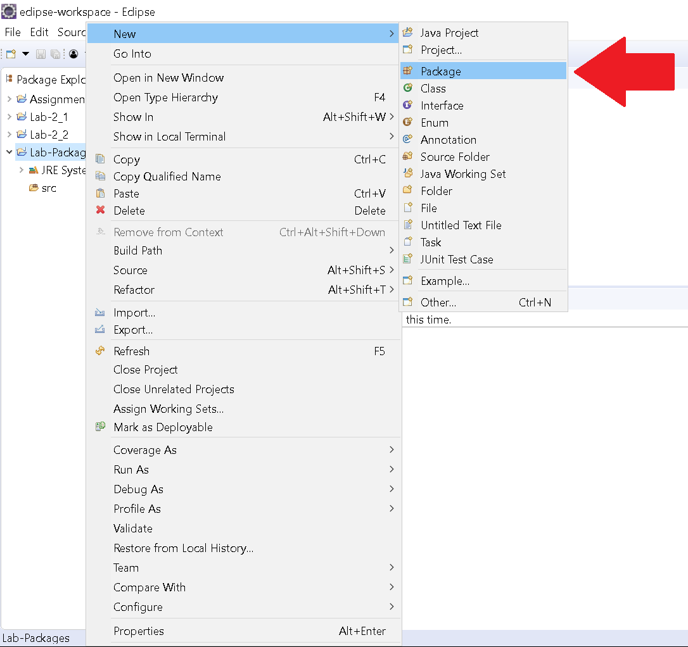
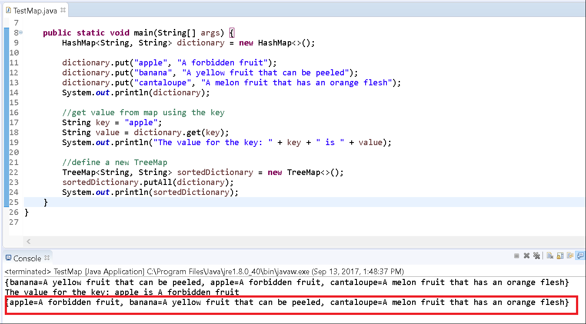
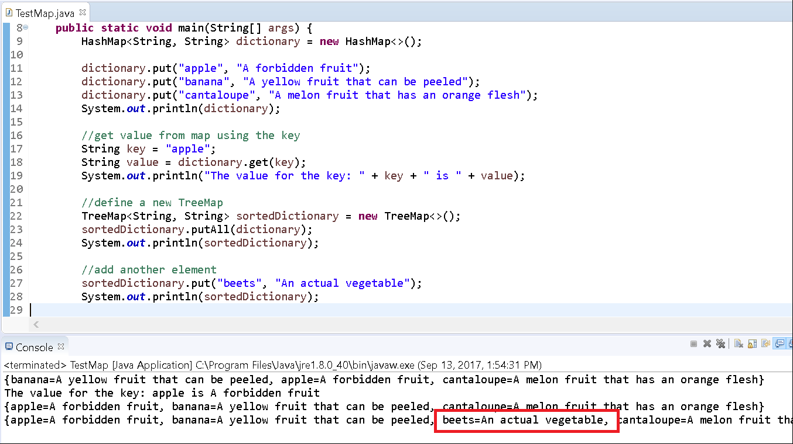
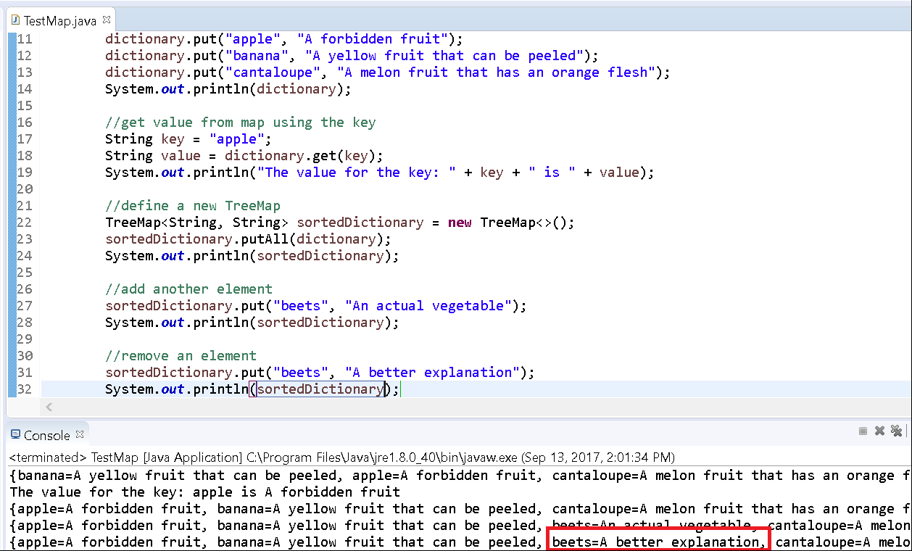

# Creating a Dictionary

## Background

Recall that a map is a unique data structure that is does not fall directly under the Java Collection hierarchy and defines elements as key/value pairs. Like other structures, you can still add/remove elements.

## Instructions

In this exercise, you'll use the provided implementations of a Map and explore its usage in organizing data.

### Project Setup

1.  Open your IDE (Eclipse), and select File > New > Java Project.  
2.  You will need to create a new project folder for this task and name it Lab-Map. You can use the default settings when creating the new project. Click Finish.
3.  Right-click on the newly created project and select New > Package. 
4. Provide the name com.yourname.test for your package. Replace "yourname" with your actual firstname.
5. Right-click on the newly created package and select New > Class.
6. Create the following class, TestMap in this package (com.yourname.test):

```java
    package com.yourname.test;
    
    import java.util.HashMap;
    
    public class TestMap{
    
      public static void main(String[] args) {
        HashMap<String, String> dictionary = new HashMap<>();
        dictionary.put("apple", "A forbidden fruit");
        dictionary.put("banana", "A yellow fruit that can be peeled");
        dictionary.put("cantaloupe", "A melon fruit that has an orange flesh");
        System.out.println(dictionary);
      }
    }
```

Run the program.

You should see the following output:


Notice that you've successfully added three keys and their associated values to the map. Also, the keys are not in any particular order and different than the order of when we placed them.

Let's simulate getting a value by using a key.

Update your code to resemble the following:

```java
    package com.yourname.test;
    
    import java.util.HashMap;
    
    public class TestMap{
    
      public static void main(String[] args) {
        HashMap<String, String> dictionary = new HashMap<>();
    
        dictionary.put("apple", "A forbidden fruit");
        dictionary.put("banana", "A yellow fruit that can be peeled");
        dictionary.put("cantaloupe", "A melon fruit that has an orange flesh");
        System.out.println(dictionary);
    
        //get value from map using the key
        String key = "apple";
        String value = dictionary.get(key);
        System.out.println("The value for the key: " + key + " is " + value);
      }
    }
```

Run the program.

You'll notice output like the following:


Notice that the map returns the correct "definition" for the key, apple.

Now, let's say you wanted to keep the keys sorted like a regular dictionary does. We can use a TreeMap to manage the keys/value pairs.

Edit your file to define a new TreeMap, sortedDictionary. Remember to include the import statement for it.

```java
    package com.yourname.test;
    
    import java.util.HashMap;
    import java.util.TreeMap;
    
    public class TestMap{
    
      public static void main(String[] args) {
        HashMap<String, String> dictionary = new HashMap<>();
    
        dictionary.put("apple", "A forbidden fruit");
        dictionary.put("banana", "A yellow fruit that can be peeled");
        dictionary.put("cantaloupe", "A melon fruit that has an orange flesh");
        System.out.println(dictionary);
    
        //get value from map using the key
        String key = "apple";
        String value = dictionary.get(key);
        System.out.println("The value for the key: " + key + " is " + value);
    
        //define a new TreeMap
        TreeMap<String, String> sortedDictionary = new TreeMap<>();
      }
    }
```

Now, instead of copy/pasting the code from before to add items, we can use the putAll method to add all items in dictionary into sortedDictionary.

```java
    package com.yourname.test;
    
    import java.util.HashMap;
    import java.util.TreeMap;
    
    public class TestMap{
    
      public static void main(String[] args) {
        HashMap<String, String> dictionary = new HashMap<>();
    
        dictionary.put("apple", "A forbidden fruit");
        dictionary.put("banana", "A yellow fruit that can be peeled");
        dictionary.put("cantaloupe", "A melon fruit that has an orange flesh");
        System.out.println(dictionary);
    
        //get value from map using the key
        String key = "apple";
        String value = dictionary.get(key);
        System.out.println("The value for the key: " + key + " is " + value);
    
        //define a new TreeMap
        TreeMap<String, String> sortedDictionary = new TreeMap<>();
        sortedDictionary.putAll(dictionary);
        System.out.println(sortedDictionary);
      }
    }
```

Run the program.

You'll notice the following result:



You should observe that the keys are stored in alphabetical order.

Let's add another key/value pair to the sortedDictionary. Update your code to the following:

```java
    package com.yourname.test;
    
    import java.util.HashMap;
    import java.util.TreeMap;
    
    public class TestMap{
    
      public static void main(String[] args) {
        HashMap<String, String> dictionary = new HashMap<>();
    
        dictionary.put("apple", "A forbidden fruit");
        dictionary.put("banana", "A yellow fruit that can be peeled");
        dictionary.put("cantaloupe", "A melon fruit that has an orange flesh");
        System.out.println(dictionary);
    
        //get value from map using the key
        String key = "apple";
        String value = dictionary.get(key);
        System.out.println("The value for the key: " + key + " is " + value);
    
        //define a new TreeMap
        TreeMap<String, String> sortedDictionary = new TreeMap<>();
        sortedDictionary.putAll(dictionary);
        System.out.println(sortedDictionary);
    
        //add another element
        sortedDictionary.put("beets", "An actual vegetable");
        System.out.println(sortedDictionary);
      }
    }
```

Re-run the program.

You'll see the following result:



What happens if you add the same key with a different value?

Update your code to add the beets key again, but with a different value:

```java
    package com.yourname.test;
    
    import java.util.HashMap;
    import java.util.TreeMap;
    
    public class TestMap{
    
      public static void main(String[] args) {
        HashMap<String, String> dictionary = new HashMap<>();
    
        dictionary.put("apple", "A forbidden fruit");
        dictionary.put("banana", "A yellow fruit that can be peeled");
        dictionary.put("cantaloupe", "A melon fruit that has an orange flesh");
        System.out.println(dictionary);
    
        //get value from map using the key
        String key = "apple";
        String value = dictionary.get(key);
        System.out.println("The value for the key: " + key + " is " + value);
    
        //define a new TreeMap
        TreeMap<String, String> sortedDictionary = new TreeMap<>();
        sortedDictionary.putAll(dictionary);
        System.out.println(sortedDictionary);
    
        //add another element
        sortedDictionary.put("beets", "An actual vegetable");
        System.out.println(sortedDictionary);
    
        //re-add an element
        sortedDictionary.put("beets", "A better explanation");
        System.out.println(sortedDictionary);
      }
    }
```

Run the program.

You'll notice the output as follows:



You should observe that a duplicate key is not created. Instead the value is updated to the new one specified.

Lastly, we'll explore usage of the `keySet()` method. It is used to retrieve a List of all keys in the Map.

Update your file the following:

```java
    package com.yourname.test;
    
    import java.util.HashMap;
    import java.util.Set;
    import java.util.TreeMap;
    
    public class TestMap{
    
      public static void main(String[] args) {
        HashMap<String, String> dictionary = new HashMap<>();
        dictionary.put("apple", "A forbidden fruit");
        dictionary.put("banana", "A yellow fruit that can be peeled");
        dictionary.put("cantaloupe", "A melon fruit that has an orange flesh");
        System.out.println(dictionary);
    
        //get value from map using the key
        String key = "apple";
        String value = dictionary.get(key);
        System.out.println("The value for the key: " + key + " is " + value);
    
        //define a new TreeMap
        TreeMap<String, String> sortedDictionary = new TreeMap<>();  
        sortedDictionary.putAll(dictionary);
        System.out.println(sortedDictionary);
    
        //add another element
        sortedDictionary.put("beets", "An actual vegetable");
        System.out.println(sortedDictionary);
    
        //re-add an element
        sortedDictionary.put("beets", "A better explanation");
        System.out.println(sortedDictionary);
    
        //create a Set of keys
        Set<String> keys = sortedDictionary.keySet();
      }
    }
```

Note that we've specified a Set (we don't use a specific implementation) and we've also specified that the datatype it holds is a String. This is because our map was specified to hold a `<String, String>` type; meaning that the keys are `String` data types and the values are `String` data types as well. If it were integer keys and double values, then our map would've been declared as such:

```java
    HashMap<Integer, Double> map = new HashMap<>();
```

Next, we'll use the enhanced for-loop to iterate over the keys and print them.

```java
    package com.yourname.test;
    
    import java.util.HashMap;
    import java.util.Set;
    import java.util.TreeMap;
    
    public class TestMap{
    
      public static void main(String[] args) {
        HashMap<String, String> dictionary = new HashMap<>();
        dictionary.put("apple", "A forbidden fruit");
        dictionary.put("banana", "A yellow fruit that can be peeled");
        dictionary.put("cantaloupe", "A melon fruit that has an orange flesh");
        System.out.println(dictionary);
    
        //get value from map using the key
        String key = "apple";
        String value = dictionary.get(key);
        System.out.println("The value for the key: " + key + " is " + value);
    
        //define a new TreeMap
        TreeMap<String, String> sortedDictionary = new TreeMap<>();
        sortedDictionary.putAll(dictionary);
        System.out.println(sortedDictionary);
    
        //add another element
        sortedDictionary.put("beets", "An actual vegetable");
        System.out.println(sortedDictionary);
    
        //re-add an element
        sortedDictionary.put("beets", "A better explanation");
        System.out.println(sortedDictionary);
    
        //create a Set of keys
        Set<String> keys = sortedDictionary.keySet();
       
        for(String s: keys) {
          System.out.println("key: " + s);
        }
      }
    }
```

Run the program.

You'll see a result like the following:


This concludes the lab.