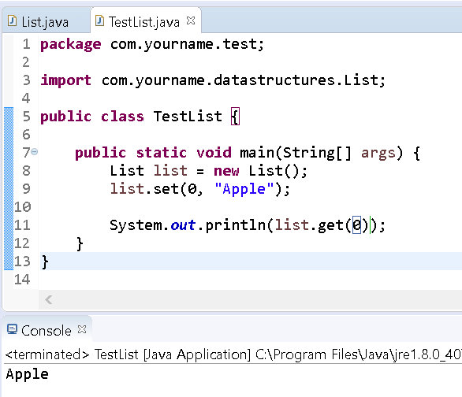

# Creating a List with Arrays

## Background

Recall that a list is a data structure that is like an array (every element has an index), but it additionally provides methods to add/remove elements as well as a manner for retrieving elements by index.

## Instructions

In this exercise, you'll create an implementation of a list by creating your own custom object.

### Project Setup

1.  Open your IDE (Eclipse), and select File > New > Java Project.
2.  You will need to create a new project folder for this task and name it Lab-List. You can use the default settings when creating the new project. Click Finish.
3.  Right-click on the newly created project and select New > Package.

4.  Provide the name `com.yourname.datastructures` for your package. Replace "yourname" with your actual firstname.   
5.  Right-click on the newly created package and select New > Class.   
6.  Create the following class in this package (com.yourname.datastructures)
    
```java
package com.yourname.datastructures;
    
public class List{
    
}
```

Since we're trying to model a list, the first thing we need to do is keep track of the elements in our list.
The best way to represent our collection of elements is with an array. In this scenario, let's restrict our array to be a String array.
We'll also need a default size for our array. For now, let's choose 8 (the number of bits in a byte).

Update your code to look like the following

```java
package com.yourname.datastructures;

public class List{
  private String[] elements = new String[8];
}
```

### Retrieving elements

We need a way to retrieve an element. Say, given an index, return the element at that index. Well, we can write a method that will return the element at the index of the array.

Update the class to specify a get method:

```java
package com.yourname.datastructures;

public class List{
     private String[] elements = new String[8];

     public String get(int index){
    return this.elements[index];
  }
}
```

### Setting elements

We also need a way to set a specific element if provided an index and a value. Since we have an array as our main backing structure, we can simply set that index's value to the provided one

Update the class to add a set method:

```java
package com.yourname.datastructures;

public class List{
     private String[] elements = new String[8];

     public String get(int index){
       return this.elements[index];
     }

     public void set(int index, String value){
    this.elements[index] = value;
  }
}
```

Great. So now we have a way to get and set elements in our list. To test this functionality we'll create a test class.

Create a new class TestList in a new package com.yourname.test.

```java
package com.yourname.test;

import com.yourname.datastructures.List;

public class TestList{
     public static void main(String[] args){
       List list = new List();
       list.set(0, "Apple");
       System.out.println(list.get(0));
  }
}
```

Run the program.

You'll see the following output.



### Adding Elements

Our class doesn't really do much beyond what an array can accomplish if you know the size and index ahead of time.

So let's create methods to add/remove elements to the next open spot in the array. One thing to keep in mind is that the private array should grow and shrink in size automatically based on the number of elements that are part of the list. For example on the 9th element the elements array should double in size. This memory allocation technique is called the buddy system and decreases the number of times a new array will be made when adding an element.

Also, when adding the first element the list should add it to the front of the array. We'll simply define a new method add that will take in a String.

Edit your List class to create an add method like the following:

```java
    public int add(String value) {
        int index = -1;
        
        //if there is already a null element in the array, assign value at that index
        for (int i = 0; i < elements.length; i++) {
            if (null == elements[i]) {
                elements[i] = value;
                return i;
            }
        }

        //if here then we need to increase the size of the elements array
        String[] temp = new String[elements.length*2];
 
        for (int i = 0; i < elements.length; i++) {
            temp[i] = elements[i];
        }
 
        //add in new value
        index = elements.length;
        temp[elements.length] = value;

        //copy temp to elements variable
        elements = temp;

        return index;
    }
```

Update the TestList class to use our new method.

```java
package com.yourname.test;

import com.yourname.datastructures.List;

public class TestList {

     public static void main(String[] args) {
       List list = new List();
    list.set(0, "Apple");

    System.out.println(list.get(0));

    int index = list.add("Banana");

       System.out.println(index);
       System.out.println(list.get(index));
  }
}
```

Run the program.

You'll see the following output:


Based on the output, you'll see that we've successfully added an item to the list and returned its index '1'.

Let's now create a method to remove an item.

### Removing items

Removing an item in the list should set the value of the last element in the list to null. Furthermore, whatever value that is removed should be returned from the method.

Open the List file and add the following method:

```java
...
    public String remove() {
        int index = -1;
        String value = "";
    
        //loop through list backwards and remove last element
        for (int i = elements.length-1; i >= 0; i--) {
            if (null != elements[i]) {
                index = i;
                value = elements[i];
                elements[i] = null;
                break;
            }
        }
     
        //return early if index is still -1 (empty list)
        if (index == -1){
            return value;
        }
    
        //check if we need to decrease the size of the elements array
        if (index % 8 == 0 && elements.length > 8 &&   elements.length > index){
            String[] temp = new String[index];
     
            for (int i = 0; i < temp.length; i++) {
            temp[i] = elements[i];
            }
    
            //copy temp to elements variable
            elements = temp;
        }
    
        return value;
    }
```

Now edit the TestList file to add multiple values to the list and remove the last one.

```java
package com.yourname.test;

import com.yourname.datastructures.List;

public class TestList {

    public static void main(String[] args) {
        List list = new List();
        list.set(0, "Apple");

        System.out.println(list.get(0));
   
        int index = list.add("Banana");

        System.out.println(index);
        System.out.println(list.get(index));

        list.add("Canteloupe");
        list.add("Dragonfruit");
        list.add("Elderberry");
        list.add("Fig");
        list.add("Grape");
        list.add("Honeyberry");
        list.add("Jujube");

        String value = list.remove();
        System.out.println(value);

        value = list.remove();
        System.out.println(value);
    }
}
```

Run the program.

You'll see output like the following:


This completes the lab.