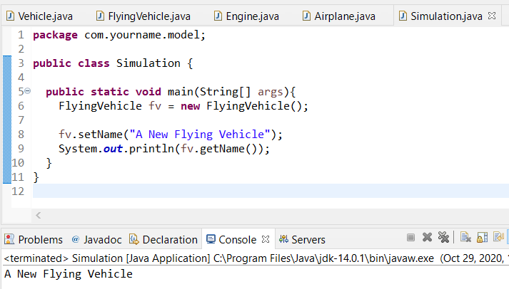
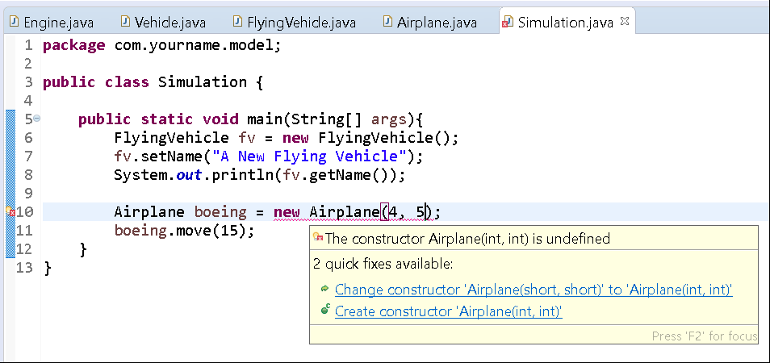
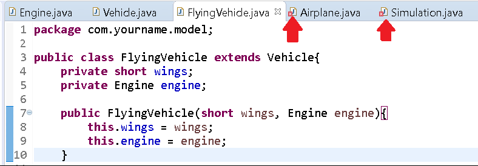
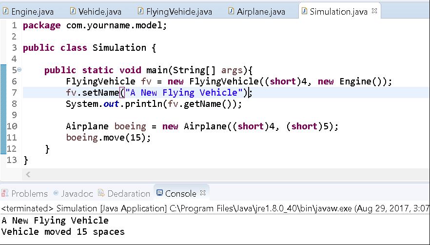

# Inheritance

## Background

In this exercise, you'll practice creating a hierarchy of classes that serve as a family of functionality.

Recall that inheritance is the OOP (object-oriented programming) principle that deals with subclasses receiving methods and instance variable definitions from their parents.

To create a subclass, you'll use the keyword `extends` as in the following:

```java
public class B extends A {}
```

> **NOTE:** A class can only extend one class.


Recall that the keyword `super` is used to refer to a class's parent class.

## Instructions

Now that you have some background on inheritance, we'll walk through modeling an Airplane.

We'll create a basic generic Vehicle class that defines some properties related to all vehicles and then we'll define an Airplane class as a subclass that defines some behavior for all planes. We'll finally create a subclass of Airplane called Jet in which we define properties and behavior related to a Jet.

### Vehicle Structure

A Vehicle will define the following properties:

*   name (String)
*   serialNumber (long)
    

A Vehicle will define the following behavior:

*   move() - a method used to move the vehicle
*   move(int spaces) - a method to move the specified number of spaces
    

### Flying Vehicle Structure

A FlyingVehicle will be a child class of Vehicle.

A FlyingVehicle will define the following properties:

*   wings (short)
*   engine (Engine)
    

A FlyingVehicle will define the following behavior:

*   fly() - a method to soar
*   refuel() - a method to refuel itself
*   liftOff() - a method for taking off
*   land() - a method to land safely
    

### Airplane Structure

An Airplane will extend a FlyingVehicle.

An Airplane will define the following properties:

*   wheels (short)
*   propellers (short)
    

An Airplane will define the following behavior:

*   turn() - a method to turn
    

### Engine Structure

An Engine is a class that represents an Engine. It is not part of the hierarchy.

An Engine has the following properties:

*   size (int)
    

An Engine has the following behavior:

*   off() - a method to turn the engine off
*   on() - a method to turn the engine on
    

### Project Setup

1.  Open your IDE (Eclipse), and select File > New > Java Project.
2.  Provide the name, Lab-Inheritance and click OK.(Select "Don't Create" if a window comes up asking to "Create a module-info.java" file.)
3.  Right-click on the newly created project and select New > Package. 
4. Provide the name com.yourname.model for your package. Replace "yourname" with your actual firstname.
5. Right-click on the newly created package and select New > Class.
6. Provide the name Vehicle for the class. Edit its contents to define its properties and behavior.

```java
package com.yourname.model;

public class Vehicle {
     private String name;
     private long serialNumber;

     //getters and setters
     public String getName(){ return this.name; }
     public void setName(String name){ this.name = name; }

     public long getSerialNumber() { return this.serialNumber; }
     public void setSerialNumber(long serialNumber) {this.serialNumber = serialNumber; }
 
     public void move(){
       System.out.println("Vehicle is moving…");
  }

     public void move(int spaces){
    System.out.println("Vehicle moved " + spaces + " spaces");
     }
}
```

Excellent. We have great functionality for our model of a vehicle. It is a generic template, but it'll serve well in our hierarchy.

Now define the FlyingVehicle class. Place this file in the same package.

```java
package com.yourname.model;

public class FlyingVehicle {
    private short wings;
    private Engine engine;

     //getters and setters
     public short getWings(){ return this.wings; }
     public void setWings(short wings){ this.wings = wings; }

     public Engine getEngine() { return this.engine; }
     public void setEngine(Engine engine) {this.engine = engine; }

     public void fly(){
    System.out.println("FlyingVehicle is flying…");
     }

     public void refuel(){
    System.out.println("FlyingVehicle is refueling");
  }

     public void liftOff(){
    System.out.println("FlyingVehicle is lifting off...");
     }

     public void land(){
    System.out.println("FlyingVehicle is landing...");
     }
}
```

Notice that FlyingVehicle defines an Engine as a property (instance variable). Here we don't need to know how Engine works, only where to get it. Since it isn't created yet, we'll create one now.

Right-click on the project, and select New > Class.

Type Engine for the name and click on Finish.

Edit the contents of Engine to be like the following:

```java
package com.yourname.model;

public class Engine {

    public void on() {
        System.out.println("Turning engine on");
    }

    public void off(){
        System.out.println("Turning engine off");
    }
}
```

Save the file. This will serve as the class that we'll use in our FlyingVehicle class.

To complete the hierarchy, we still need to define the Airplane class.

Create a new class and name it Airplane.

Edit the class to resemble the following:

```java
package com.yourname.model;

public class Airplane {
    private short wheels;
    private short propellers;

    //getters and setters
    public short getWheels(){ return this.wheels; }
    public void setWheels(short wheels){ this.wheels = wheels; }

    public short propellors() { return this.propellers; }
    public void setPropellers(short propellers) {this.propellers = propellers; }

    public void turn(){
        System.out.println("Turning...");
    }
}
```

Great. Now we have our model setup. Our model is the class representation of our real-world entities.

We're missing one thing, though. We haven't specified the keyword extends to defined the hierarchy.

FlyingVehicle should be a child of Vehicle. Edit the file to use the keyword extends to make it a child of Vehicle.

```java
package com.yourname.model;

public class FlyingVehicle extends Vehicle{
    . . .
}
```

Airplane is a child of FlyingVehicle. Use the keyword extends to make it a child of FlyingVehicle.

```java
package com.yourname.model;

public class Airplane extends FlyingVehicle{
    ...
}
```

Great.

The hierarchy is now setup.

Right-click on the package and create a new class, Simulation.

Your package should look like this:


Edit the Simulation class to create an instance of FlyingVehicle in a main method.

```java
package com.yourname.model;

public class Simulation {

    public static void main(String[] args){
        FlyingVehicle fv = new FlyingVehicle();
    }
}
```

We've started in the middle of our hierarchy with FlyingVehicle. Since a FlyingVehicle is a Vehicle we can access properties and methods that are defined for Vehicle (so long as they are visible).

Set the name of FlyingVehicle and print its value to the console.

```java
package com.yourname.model;

public class Simulation {

    public static void main(String[] args){
        FlyingVehicle fv = new FlyingVehicle();

        fv.setName("A New Flying Vehicle");
        System.out.println(fv.getName());
    }
}
```

Save the file and run the program.

You'll see output like the following:



Notice how we were able to use the methods `setName()` and `getName()` although they were only defined in the parent class Vehicle. We're using a FlyingVehicle which is a subclass, so it inherited that behavior.

Now let's see what we can do with Airplane.

We'll create an instance of Airplane and call the `move(int spaces)` method.

```java
package com.yourname.model;

public class Simulation {

     public static void main(String[] args){
    FlyingVehicle fv = new FlyingVehicle();
    fv.setName("A New Flying Vehicle");

    System.out.println(fv.getName());

    Airplane boeing = new Airplane();
    boeing.move(15);
  }
}
```

Save the file and run the program.

You'll see output like the following:


Again, we've used the principle of inheritance to call a method that was defined earlier in the hierarchy (a grandparent, if you will) on a class. In this scenario, we've used the move method on an Airplane object.

### Constructors and Inheritance

Let's say we wanted to define a constructor on Airplane to create some default functionality. Perhaps, we want to accept values for the number of wheels and propellers it has when instantiating it.

Update the Airplane class to define a new constructor that has those two parameters:

```java
package com.yourname.model;

public class Airplane extends FlyingVehicle{
    private short wheels;
    private short propellers;

    public Airplane(short wheels, short propellers) {
        this.wheels = wheels;
        this.propellers = propellers;
    }
    
    ...
}
```

Save the file and open your Simulation class.

It'll have the line where we create a new Airplane instance underlined.


Reading the error, we can see that this is a quick fix. All we need to do is pass in some default values for wheels and propellers to match our defined constructor.

Update the code to pass in two numbers and save the file.

```java
package com.yourname.model;

public class Simulation {

    public static void main(String[] args){
        FlyingVehicle fv = new FlyingVehicle();
        fv.setName("A New Flying Vehicle");

        System.out.println(fv.getName());

        Airplane boeing = new Airplane(4, 5);
        boeing.move(15);
    }
}
```

So, you'll notice that we have another error:



Right. Numbers are implicitly `int`'s, so we'll just cast them to `short`'s:

```java
package com.yourname.model;

public class Simulation {

    public static void main(String[] args){
        FlyingVehicle fv = new FlyingVehicle();
        fv.setName("A New Flying Vehicle");
        System.out.println(fv.getName());

        Airplane boeing = new Airplane((short)4, (short)5);
        boeing.move(15);
    }
}
```

Save the file.

Everything seems to compile fine now.


Great.

Let's say we want to do the same thing to FlyingVehicle but with wings and Engine being passed in.

Define a new constructor on FlyingVehicle to take in wings and Engine:

```java
package com.yourname.model;

public class FlyingVehicle {
    private short wings;
    private Engine engine;

    public FlyingVehicle(short wings, Engine engine){
        this.wings = wings;
        this.engine = engine;
    }
    ...
}
```

Save the file.

Notice that both Airplane and Simulation now present errors:



Let's move to Simulation first, since this will most likely be similar to when we updated Airplane.

Update the code in Simulation for to pass in default values when creating a new FlyingVehicle.

```java
package com.yourname.model;

public class Simulation {

    public static void main(String[] args){
        FlyingVehicle fv = new FlyingVehicle((short)4, new Engine());
        fv.setName("A New Flying Vehicle");
        System.out.println(fv.getName());

        Airplane boeing = new Airplane((short)4, (short)5);
        boeing.move(15);
    }
}
```

Save the file. Now, no errors are present in this file, so let's see what happens when we run it.


Hmm. It seems that the code ran smoothly until it reached line 10 where it tried to create an instance of Airplane. So what could be the problem?

Opening the file and hovering your mouse over the underlined code will reveal the error:


The error indicates that the super constructor FlyingVehicle is undefined…

When instantiating a class, your code will execute that class's constructor. Implied within all constructors is a call to that class's superclass.

Although, we've written this:

```java
...
public Airplane(short wheels, short propellers) {
    this.wheels = wheels;
    this.propellers = propellers;
}
...
```

The compiler actually silently inserts a call to `super()` for you if you don't specify it. So the code more resembles this:

```java
. . .
public Airplane(short wheels, short propellers) {
    super();

    this.wheels = wheels;
    this.propellers = propellers;
}
...
```

This means that a chain of constructors is created and called when instantiating a child class.

In this scenario, we're creating an Airplane. It is a child class of FlyingVehicle. So, implied is a call to `FlyingVehicle()`. But this constructor is not defined!

Recall that the compiler will only create a default no-arg constructor in the event that you don't create a constructor yourself. Here, we've defined a constructor already for FlyingVehicle, it takes in two parameters.

The solution here is either to rewrite Airplane to explicitly call the constructor we've created or to provide a default no-arg constructor ourselves.

Let's simply add a new constructor that is a no-arg one.

Update FlyingVehicle to specify a no-arg constructor:

```java
package com.yourname.model;

public class FlyingVehicle {
    private short wings;
    private Engine engine;

    public FlyingVehicle(){}

    public FlyingVehicle(short wings, Engine engine){
        this.wings = wings;
        this.engine = engine;
    }
    ...
}
```

Great.

Once you save the file, you'll notice all of the compiler errors disappear.

Run the Simulation program again and you'll observe the following output:



> **NOTE**:
> 
> If we wanted to call the other constructor instead of provide a no-arg one, we would've updated Airplane's constructor as such:
> ```java
>   ...
>   public Airplane(short wheels, short propellers) {
>       super((short)4, new Engine());
>     
>       this.wheels = wheels;
>       this.propellers = propellers;
>   }
>   ...
> ```

Notice also, that we would have to create a new Engine and pass it to the FlyingVehicle.

That completes this exercise.