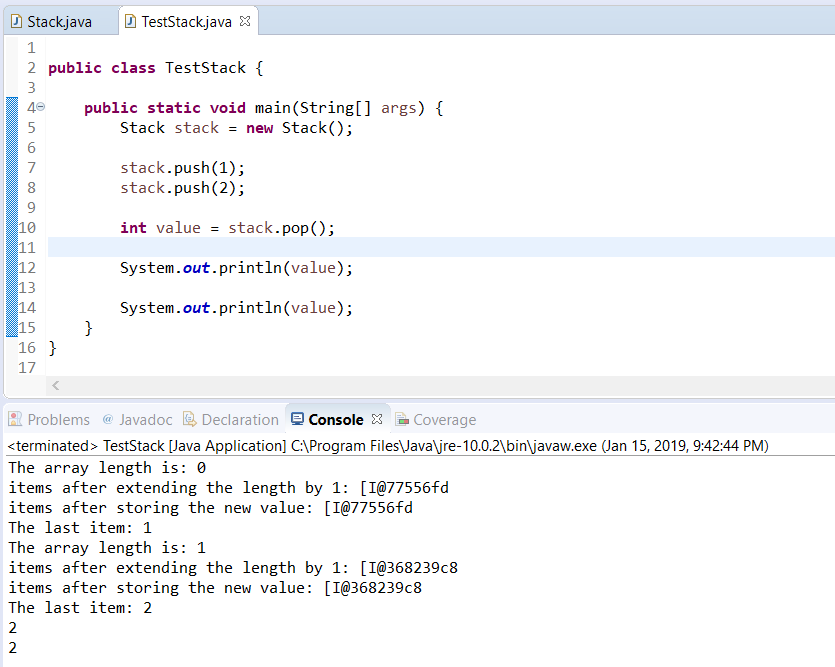
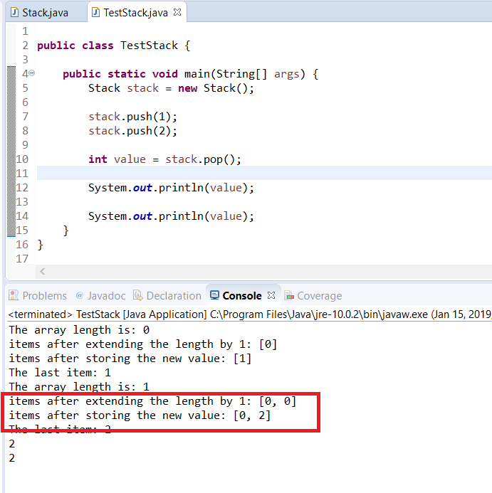

# Stacks

## Background

Recall that a stack is a LIFO (Last-In, First-Out) structure. In this method we'll guide you through implementing a stack in Java.

## Instructions

### Project Setup

1.  Open your IDE (Eclipse), and select File > New > Java Project.
2.  Provide the name, Lab-Stack and click OK.
3.  Right-click on the newly created project and select New > Class
4.  Provide the name Stack for your class. .
5.  Edit its contents so that it resembles the following 

```java
public class Stack {

  private int lastItem = 0;
  private int[] items = new int[0];

  // add items to the stack
  public void push(int newItem) {

  }

  // remove items from the stack
  public int pop() {
    return 0;
  }

  // view last item
  public int peek() {
    return 0;
  }
}
```

We'll use this basic structure to keep track of the last item we've added and an array to manage all of the items.

Notice we've initialized our items array to be 0 items long. You'll see why we did this shortly.

### Implementing Push

The first thing we'll do is implement the `push()` functionality. Push is used to add an item to the stack and update the lastItem to the one we're pushing.

To add an item to the array we'll simply add the new item (defined by the parameter) to the end of the items array. But...how do you know where the end of the array is? Since we initialized it with a length of zero, what we can do is use the length property to find the end. In addition to that, though, we must increase the length of our array so that we can actually fit some items within it. If we increase it by 1, that'll suffice to fit in our new 1 item.

So your code can look like this:

```java
public void push(int newItem){

   int index = items.length; //get current length to store as index
   items = new int[items.length + 1];  //increase the array by 1 so that we can add our new item
   items[index] = newItem; //store the value in the index

   lastItem = newItem; //update lastItem
}
```

### Implementing Pop

Adding items to the Stack is great, but we'll also need to be able to remove items so that we can do a little bit of testing of our code. You'll find that our current approach to a Stack may be challenging to support.

For instance we have a reference to the last item, but we can't simply return that? We need to remove it entirely from the array. Arrays are fixed-sized objects in Java, so that means we'll have to copy over all of the elements to a new array and get rid of the old one.

Add the following code to your class:

```java
public int pop(){

  int tempItem = lastItem; //store the last item into a variable
  
   //copy a new array but remove last item
   int[] newArray = new int[items.length-1];

   for(int i = 0; i < newArray.length; i++){
     newArray[i] = items[i];
  }

   items = newArray; //update the items array
   lastItem = items[items.length-1]; //update lastItem

   //return our ‘popped' element
   return tempItem;
}
```

Ok. So now we can test our code a bit.

### Testing your Stack

Create a new class in your project called TestStack.

Add the following contents to TestStack:

```java
public class TestStack {

  public static void main(String[] args) {
    Stack stack = new Stack();

    stack.push(1);
    stack.push(2);

    int value = stack.pop();

    System.out.println(value);
    System.out.println(value);
  }
}
```

Essentially, we'll try adding two values to the stack and them popping them off. What happens when you run the code?


The console prints out `2` twice?!?!

Why is that?

Just looking at our code you may already have an inclination. However, imagine that you really weren't sure (and maybe you're not). Then you should start by examining how each of our methods accomplish their tasks.

Thus, let's reexamine the `push()` method first. One simple approach to debugging our issue is to use `System.out.println(...)` statements to verify our assumed values.

Update your push method to reflect the below changes which add `println()` statements after each time we alter any data.

```java
public void push(int newItem) {

  int index = items.length; // get current length to store as index
  System.out.println("The array length is: " + index);

  items = new int[items.length + 1]; // increase the array by 1 
  System.out.println("items after extending the length by 1: " + items);

  items[index] = newItem; // store the value in the index
  System.out.println("items after storing the new value: "+ items);

  lastItem = newItem; // update lastItem
  System.out.println("The last item: " + lastItem);
}
```

Re-run the TestStack class.

What do you see on the console?



The first line is fine, but then the second line has this interesting output that starts with a left bracket "\[". Recall that arrays are objects and printing an object defaults to its memory location. So what is display on the console is actually a memory address.

A simple shortcut that we'll show you is to use the Arrays class and call the `Arrays.toString(...)` method. This methods will convert the contents of an array to a String.

Update your code to use `Arrays.toString(...)`:

```java
public void push(int newItem) {

  int index = items.length; // get current length to store as index
  System.out.println("The array length is: " + index);

  items = new int[items.length + 1]; // increase the array by 1
  System.out.println("items after extending the length by 1: " + Arrays.toString(items));

  items[index] = newItem; // store the value in the index
  System.out.println("items after storing the new value: "+ Arrays.toString(items));

  lastItem = newItem; // update lastItem
  System.out.println("The last item: " + lastItem);
}
```

Re-run the TestStack class and you'll see output like the following:



Highlighted in red we have a particular issue.

The value printed is \[0, 0\] and then \[0, 2\]. This indicates that our array is not saving any previous values! On further inspection of the code, we can see that instead of copying the values of the array when we extend it by one element we merely create a new array which will default to have all 0's as elements.


The lab is now complete. 