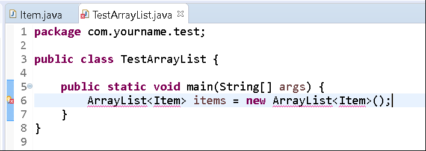
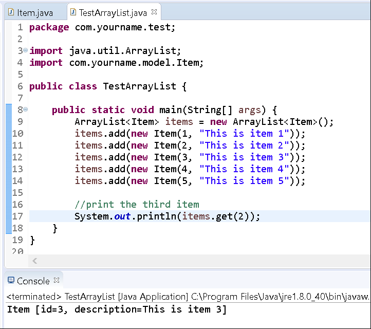
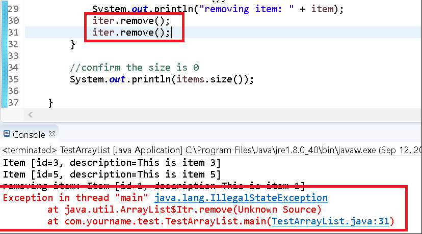

# Using ArrayList

## Background

Recall that a list is a data structure that is like an array (every element has an index), but it additionally provides methods to add/remove elements as well as a manner for retrieving elements by index. Unlike arrays, ArrayLists is a class from the Collection framework; it can only contain objects.

## Instructions

In this exercise, you'll use the provided implementation ArrayList and see how you can add specific elements to it.

### Project Setup

1.  Open your IDE (Eclipse), and select File > New > Java Project.
2.  You will need to create a new project folder for this task and name it **Lab-ArrayList**. You can use the default settings when creating the new project. Click Finish.
3.  Right-click on the newly created project and select New > Package. 
4. Provide the name `com.yourname.model` for your package. Replace "yourname" with your actual firstname.
5. Right-click on the newly created package and select New > Class.
6. Create the following class in this package (com.yourname.model)

```java
package com.yourname.model;

public class Item {
    private int id;
    private String description;

    public Item() {}

    public Item(int id, String description) {
        super();
        this.id = id;
        this.description = description;
    }

    public int getId() {
        return id;
    }

    public void setId(int id) {
        this.id = id;
    }

    public String getDescription() {
        return description;
    }

    public void setDescription(String description) {
        this.description = description;
    }

    @Override
    public String toString() {
        return "Item [id=" + id + ", description=" + description + "]";
    }
}
```

So we have a model of a generic item, and we'll create a List of them in another class and interact with them.

Create a new Class, TestArrayList, in a new package, com.yourname.test.

```java
package com.yourname.test;

public class TestArrayList {
    public static void main(String[] args) {
        ArrayList<Item> items = new ArrayList<Item>();
    }
}
```

When typing up this line, you'll notice a couple compiler errors.



The first states the ArrayList cannot be resolved to a type.


The second states the same for the Item class.

Update your class to specify two import statements; one for each object.

```java
package com.yourname.test;

import java.util.ArrayList;
import com.yourname.model.Item;

public class TestArrayList {
    public static void main(String[] args) {
        ArrayList<Item> items = new ArrayList<Item>();
    }
}
```

Now, let's add some items to the list.

```java
package com.yourname.test;

import java.util.ArrayList;
import com.yourname.model.Item;

public class TestArrayList {
    public static void main(String[] args) {
        ArrayList<Item> items = new ArrayList<Item>();
        
        items.add(new Item(1, "This is item 1"));
        items.add(new Item(2, "This is item 2"));
        items.add(new Item(3, "This is item 3"));
        items.add(new Item(4, "This is item 4"));
        items.add(new Item(5, "This is item 5"));
    }
}
```

Now, let's get the 3rd item (which is index 2, since lists are 0-based) and print it to the console.

```java
package com.yourname.test;

import java.util.ArrayList;
import com.yourname.model.Item;

public class TestArrayList {
     public static void main(String[] args) {
       ArrayList<Item> items = new ArrayList<Item>();
       items.add(new Item(1, "This is item 1"));
       items.add(new Item(2, "This is item 2"));
       items.add(new Item(3, "This is item 3"));
       items.add(new Item(4, "This is item 4"));
    items.add(new Item(5, "This is item 5"));

       //print the third item
    System.out.println(items.get(2));
  }
}
```

Run the program.

You'll see the following result:



Now, let's remove the last item and print it to the console.

```java
package com.yourname.test;

import java.util.ArrayList;
import com.yourname.model.Item;

public class TestArrayList {

    public static void main(String[] args) {
        ArrayList<Item> items = new ArrayList<Item>();
        
        items.add(new Item(1, "This is item 1"));
        items.add(new Item(2, "This is item 2"));
        items.add(new Item(3, "This is item 3"));
        items.add(new Item(4, "This is item 4"));
        items.add(new Item(5, "This is item 5"));

       //print the third item
        System.out.println(items.get(2));

       //remove the last item
       Item removed = items.remove(items.size()-1);
       System.out.println(removed);
    }
}
```

Again, notice that we used the size minus 1 as the index because Lists are 0-based.

Run the program.

You'll see the following result:


### Iterating Through a List

To iterate or loop over a list, you can use two different approaches. Using our list above, you could write a type of for-loop or while-loop and access the index of the list to manipulate each element.

For example, the following snippet shows how to print each element of our list:

```java
//generic loop for list
System.out.println("......printing list.......");

for (int i = 0; i < items.size(); i++) {
  System.out.println(items.get(i));
}
```

This approach works fine except in some cases when you're manipulating the list within the loop. Say you wanted to print each element and remove it while looping over it like the following snippet:

```java
    //generic loop for list
    System.out.println("......printing list.......");
    
    for (int i = 0; i < items.size(); i++) {
      System.out.println(items.get(i));
     
      //remove the element
      items.remove(i);
    }
```

If you ran this snippet, you would get a result like the following:


It shows that only two elements were removed. As we remove an element, the list "shifts" the elements down by one and thus each have a new index and the size shrinks as well.

### Iterator

Another approach would be to use an Iterator to iterate over the list. Iterator is an interface that defines three methods:

1. `hasNext()` - returns true if another element is in the iteration
2. `next()` - returns the next element
3. `remove()` - removes the last element returned by this iteration (called once per call to next)

Most collection implementations define an iterator method which returns an Iterator over the collection, so you won't need to create one. (As a matter of fact, you can't create one directly, since Iterator is an interface).

Edit your TestArrayList class to use an iterator and remove each element in the list:

```java
package com.yourname.test;

import java.util.ArrayList;
import com.yourname.model.Item;

public class TestArrayList {
     public static void main(String[] args) {
       ArrayList<Item> items = new ArrayList<Item>();
       items.add(new Item(1, "This is item 1"));
       items.add(new Item(2, "This is item 2"));
       items.add(new Item(3, "This is item 3"));
       items.add(new Item(4, "This is item 4"));
    items.add(new Item(5, "This is item 5"));

       //print the third item
    System.out.println(items.get(2));

       //remove the last item
       Item removed = items.remove(items.size()-1);
    System.out.println(removed);

       //iterating over a list
       Iterator<Item> iter = items.iterator();

       while (iter.hasNext()) {
         Item item = iter.next();
         System.out.println("removing item: " + item);
         iter.remove();
    }

       //confirm the size is 0
    System.out.println(items.size());
  }
}
```

Run the program.

You'll see the last line prints `0`, confirming we've successfully removed each element.


Excellent.

Now let's play with this iteration a bit to test its limits.

Add another call to the remove method and run the program:

```java
package com.yourname.test;

import java.util.ArrayList;
import com.yourname.model.Item;

public class TestArrayList {

public static void main(String[] args) {
       ArrayList<Item> items = new ArrayList<Item>();
       items.add(new Item(1, "This is item 1"));
       items.add(new Item(2, "This is item 2"));
       items.add(new Item(3, "This is item 3"));
       items.add(new Item(4, "This is item 4"));
    items.add(new Item(5, "This is item 5"));

       //print the third item
    System.out.println(items.get(2));

       //remove the last item
       Item removed = items.remove(items.size()-1);
    System.out.println(removed);

       //iterating over a list
       Iterator<Item> iter = items.iterator();
       while (iter.hasNext()) {
         Item item = iter.next();
         System.out.println("removing item: " + item);
         iter.remove();
         iter.remove();
       }

    //confirm the size is 0
    System.out.println(items.size());
  }
}
```

You'll see the following result:



You see that the successive call to remove (without a call to next) generates an `IllegalStateException` which basically means your Iterator in is an illegal state and the second call to remove is not allowed.

So that doesn't work.

Let's try to add something to the list, while we're looping over it.

```java
package com.yourname.test;

import java.util.ArrayList;
import com.yourname.model.Item;

public class TestArrayList {
 
     public static void main(String[] args) {
       ArrayList<Item> items = new ArrayList<Item>();
       items.add(new Item(1, "This is item 1"));
       items.add(new Item(2, "This is item 2"));
       items.add(new Item(3, "This is item 3"));  
       items.add(new Item(4, "This is item 4"));
    items.add(new Item(5, "This is item 5"));

       //print the third item
    System.out.println(items.get(2));

       //remove the last item
       Item removed = items.remove(items.size()-1);
    System.out.println(removed);

    //iterating over a list
       Iterator<Item> iter = items.iterator();
       while (iter.hasNext()) {
         Item item = iter.next();
         System.out.println("removing item: " + item);
         iter.remove();
         items.add(new Item(6, "This is a new item"));
    }

       //confirm the size is 0
       System.out.println(items.size());
  }
}
```

Run the program.

You'll see the following result:


Notice that you get a `ConcurrentModificationException`. This essentially means you're trying to alter the collection (outside of calling the remove method) and this is not allowed.

This concludes the lab.