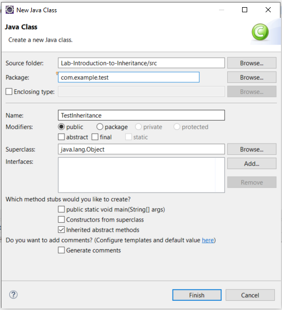

# Introduction to Inheritance

## Objectives

* Explore a simple example of inheritance.

## Background

Inheritance is one of the four pillars of object-oriented programming and deals with subclasses receiving methods and instance variable definitions from their parents.

To create a subclass, you'll use the keyword `extends` as in the following:

```java
public class B extends A {}
```

> **NOTE:** A class can only extend one class.


## Guided Practice

Below are instructions for you to follow to create a new project that uses inheritance.

### Project Setup

Open your IDE (Eclipse), and select File > New > Java Project. 

Provide the name, Lab-Introduction-to-Inheritance and click OK. 
(Select "Don't Create" if a window comes up asking to "Create a module-info.java" file.)

Right-click on the newly created project and select New > Package. Provide the package name, com.example.model. Click Finish. 

Right-click on the newly created package and select New > Class. Provide the class the name, Doll and click OK.


### Defining a parent (super) class
Now edit the file so that it looks like the following:

```java
package com.example.model;
public class Doll{
    
	protected String name;
    
	public String getName() {
		return this.name;
	}

	public void setName(String name) {
		this.name = name; 
	}
}
```

Save the file.

### Defining a child (sub) class
Create another class in the com.example.model package. Call this class ActionFigure. 

Edit the ActionFigure class so that it _extends_ Doll. Like so:
```java
package com.example.model;

public class ActionFigure extends Doll {

}
```

This creates an inheritance relationship between ActionFigure and Doll. ActionFigure IS-A type of Doll. 

> You can read "IS-A" as "is a". An ActionFigure class is a type of Doll class.

Consequently, the methods and variables declared in Doll are passed down, or rather implicitly copied into, ActionFigure.

Wonderful! Let's test our code. 

### Invoking inherited methods

Create a new class TestInheritance in a new package com.example.test. 

> **TIP**
>
>You can do this in one step by editing both the package section and the class name section. 

It should look like this:


You can edit it to resemble the following:

```java
package com.example.test;

import com.example.model.ActionFigure;

public class TestInheritance {
	public static void main(String[] args) {
		ActionFigure ironMan = new ActionFigure();
		ironMan.setName("Tony Stark");
		System.out.println(ironMan.getName());
	}
}
```
Notice that we use the methods getName() and setName() on our ActionFigure object without having defined name, getName() or setName() in our ActionFigure class. This is because ActionFigure _inherits_ these class members from Doll.  

Finally, when we run our code we see that the methods operate as we expected, and "Tony Stark" prints to the console.


This concludes our lesson. 
